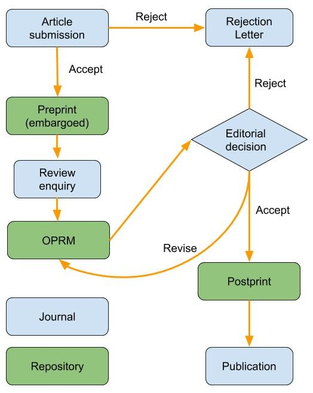

## Description
This use case is based on the OPRM Module that was developed by DIGITAL.CSIC, Open Scholar and other partners within a [​project​](https://digital.csic.es/handle/10261/131210) funded by OpenAIRE in 2016 to pilot the implementation of open peer review services on top of DSPACE repositories. Our use case is based on the current architecture of the OPRM module that was designed to serve the institutional community of the Spanish National Research Council (CSIC). This new use case is slightly different since it involves a collaboration between DIGITAL.CSIC and an external, non-institutional journal.

This use case rests on an agreement between DIGITAL.CSIC, Open Scholar and Psicologica journal and it is expected that as new technologies emerge to standardize workflows of overlay journals, more institutional repositories will be able to participate as manuscripts providers and final hosts of the published manuscripts and associated reviews. This will make it possible that repositories, instead of journals, become the entry points for preprint manuscripts.

## Workflow
1. An author submits a manuscript to the Journal (J).
2. The Journal sends the manuscript to DIGITAL.CSIC (DC).
3. DC publishes an item with the manuscript’s metadata but keeps the full text invisible.
4. The J sends invitations with a link to the manuscript’s metadata and the full text file to potential reviewers using the OPRM available at DC.
5. A reviewer sends a review using the OPRM available at DC.
6. The review is published at DC as a new item linked to the manuscript’s item
7. The J notifies the author who can submit a new version of the manuscript and start a new iteration of the process.
8. When a manuscript is accepted by the J the full text of all versions becomes visible at DC and is assigned a DOI. Associated reviews also receive DOIs.
9. The J publishes a summary of the manuscript on its website with a link to the manuscript’s instance at DC.

