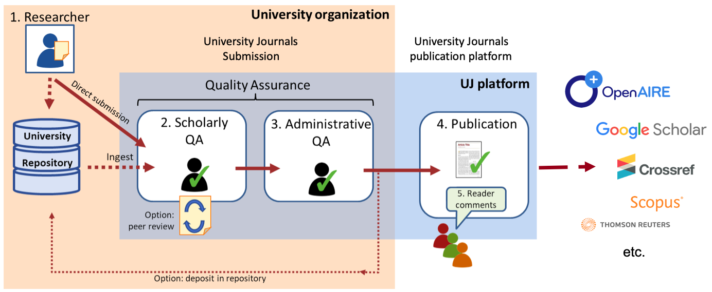

## Description

### Service Providers

| **Name**                                        | **URL**                        | **IDs**                                |
| ----------------------------------------------- | ------------------------------ | -------------------------------------- |
| University Journals                             | https://universityjournals.eu/ | Preferable DOI                         |
| IR (but can also be another trusted repository) | http://dare.uva.nl/            | Handle = handle provided by CRIS-Pure) |
| Data repository Figshare                        | https://uvaauas.figshare.com/  | DOI                                    |
| CRIS-Pure                                       | http://pure.uva.nl/admin       | Handle                                 |

University-driven journal-like publishing-as-a-service with multiple options for peer-review and quality assessments.

1. The author can submit directly to UJ, or use an IR or pre-print server.
2. UJ provides a workflow and management platform (I.e. OJS) to guide submissions and publish content.
3. Quality is ensured through a tiered workflow. Baseline quality assessment is mandatory and managed by the institute itself, further review is optional. Traditional peer-review, if any, is handled by external reviewers.
4. All quality assessment and review workflows are clearly documented and transparent. Peer-review reports and version control are available.
5. The quality assessment status of a manuscript is communicated by the platform through badges or labels. These badges follow international standards and are integrated into metadata.
6. Production and publication follows standards for content and metadata and always includes a DOI
7. Distribution at UJ does not only rely on scraping/harvesting, published content is actively distributed to abstracting and indexing services.

## Variant 1 submission to University Journals (UJs) via repository

As an Author, I want to notify University Journals about my publication in the Institutional repository or in Figshare to potentially review it and consider it for publication in UJs.

As a Scholarly Quality Assurance Officer (SQAO) of University Journals, I want to be notified of new submissions to decide on whether the manuscript can be published (as is), should be revised or has been declined.

As an Administrative Quality Assurance Officer (AQAO) of University Journals, I want to be notified of new accepted publication and decide if all administrative requirements of the journal are fulfilled or the author should be requested to supply extra details (orcids, funder statement, etc.)

As a reader of University Journals I want to know what quality assurance has been provided.

### Workflow

1. An author has deposited a manuscript in an institutional repository.
2. Author selects from a list an SQAO of the university to consider the manuscript (for publication, for internal review, for external review, etc.)
3. Author pushes a review request to selected SQAO of UJs of his/her University (with URI of the manuscript, metadata (type, authors, affiliations, email addresses, title, abstract, date of submission)
4. SQAO accepts or declines the request and informs the repository and the author about the decision.
   1. After acceptances to consider the manuscript, the SQAO informs the repository and the author about the decision: (i) rejected (repository only), (ii) accepted with revisions , (iii) push it for further review or (iv) accepted as is.
      1. Push from UJs to repository and author: *rejected* The rejection should be registered in the repository and can be shown in the repository?
      2. Push from UJs to other person for further review
      3. Push from UJs to repository and author *accepted with revisions*
         1. Author has revised manuscript
         2. Author uploads new version to repository
         3. Author notifies the SQAO of UJs via the repository of the revised version.
         4. Iteration of [4a] the academic reviewer informs the repository and the author about the decision: rejected (repository only), accepted with revisions or accepted as is
      4. Push from SQAO of UJs to AQAO of UJs that the publication has been *accepted as is.* The administrative reviewer is responsible for the administrative quality assurance (completeness of the submission: orcid, abstract, licensing, data deposit etc.)
         1. AQAO accepts or declines.
            1. AQAO declines and requests the repository / SQAO / author for more information                                        
               1. Repository / SQAO / author provides information
               2. Iterance 4.a.iii.1b.
            2. AQAO accepts
               1. UJs pulls copy of the file from the repository
               2. UJs provides new URI
               3. UJs publishes the accepted publication (incl. URI of the repository record (for previous version) *[may be by providing front matter page?]*
            3. UJs pushes to repository and author acceptance and updates the metadata of the publicationd.
            4. Repository updates metadata when the paper has been accepted (pulls URI and published version).
5. Comments or full reviews can be given by readers at UJs
6. Commentaries are pushed to the AQAO
7. AQAO declines or accepts comments. NB comments can be based on DOIs (decentral) and not be available on the UJ systems
8. In some cases the AQAO might want to consult others (authors, peers, etc.)
9. The comments can be rejected by the AQAO.
10. The comments can be accepted by the AQAO and pushed to the author and SQAO.
11. Author can push a revised version.
12. As a reader I want to know what kind of quality assurances have been done by UJs.
13. As a reader I want to know what kind of other quality assurances have been done by others.
14. As an institute I want to archive content as well as review reports, decisions and timelines, following international metadata standards to ensure portability.